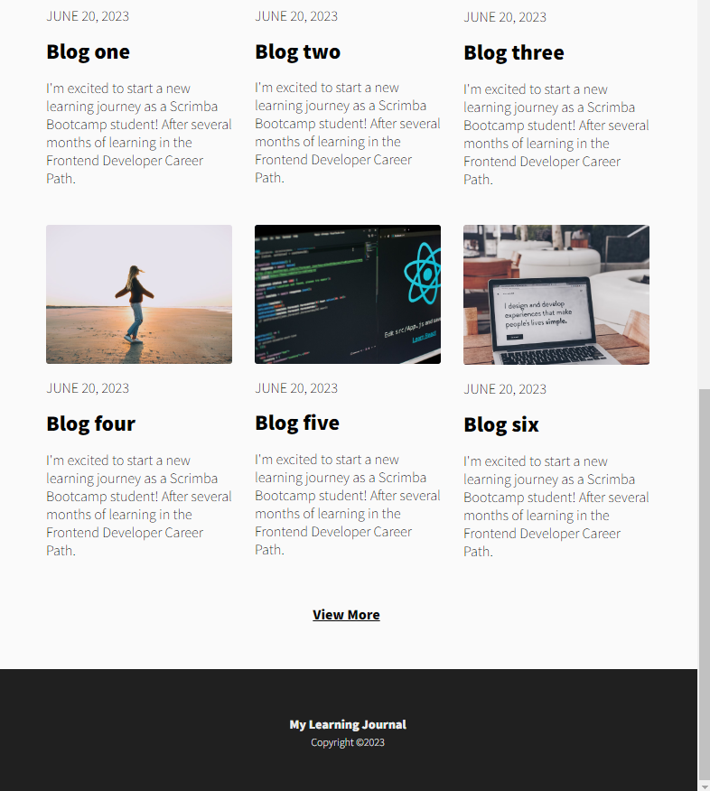
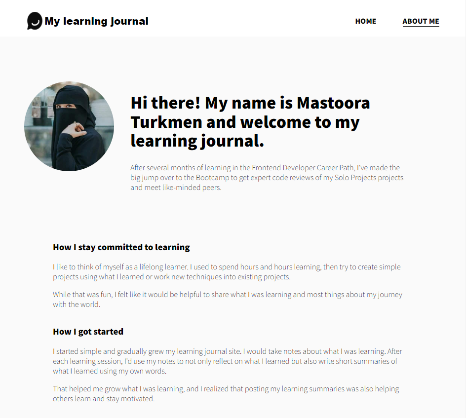
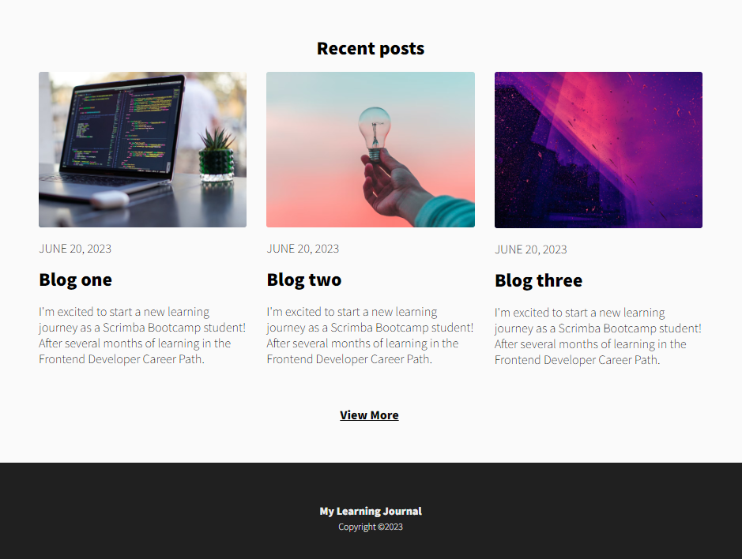

# My Learning Journal

> https://learning-journal-mastoora-turkmen.netlify.app/

Hi there! My name is Mastoora Turkmen and welcome to my learning journal.

> After several months of learning in the Frontend Developer Career Path, I've made the big jump over to the Bootcamp to get expert code reviews of my Solo Projects projects and meet like-minded peers.

### **_Home page_**

- I'm excited to start a new learning journey as a Scrimba Bootcamp student!
- After several months of learning in the Frontend Developer Career Path.

### **_About page_**

- I like to think of myself as a lifelong learner. I used to spend hours and hours learning.
- I started simple and gradually grew my learning journal site. I would take notes about what I was learning.

Thank you,
Best Regards,

Mastoora Turkmen
